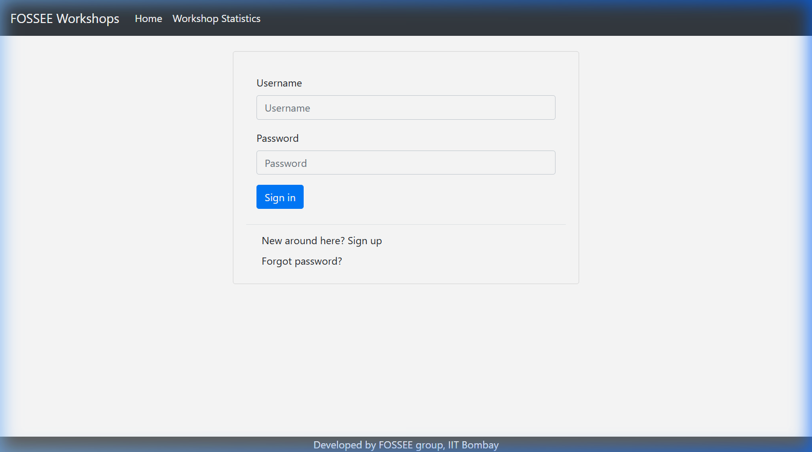
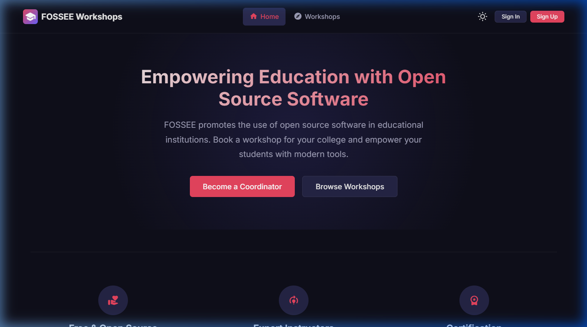
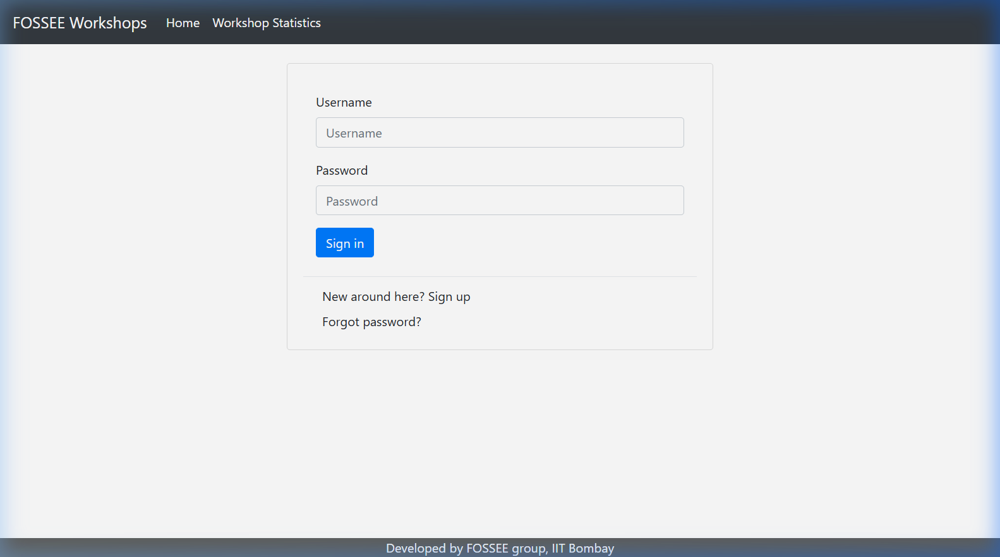
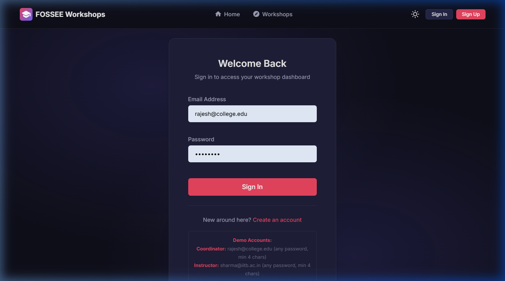
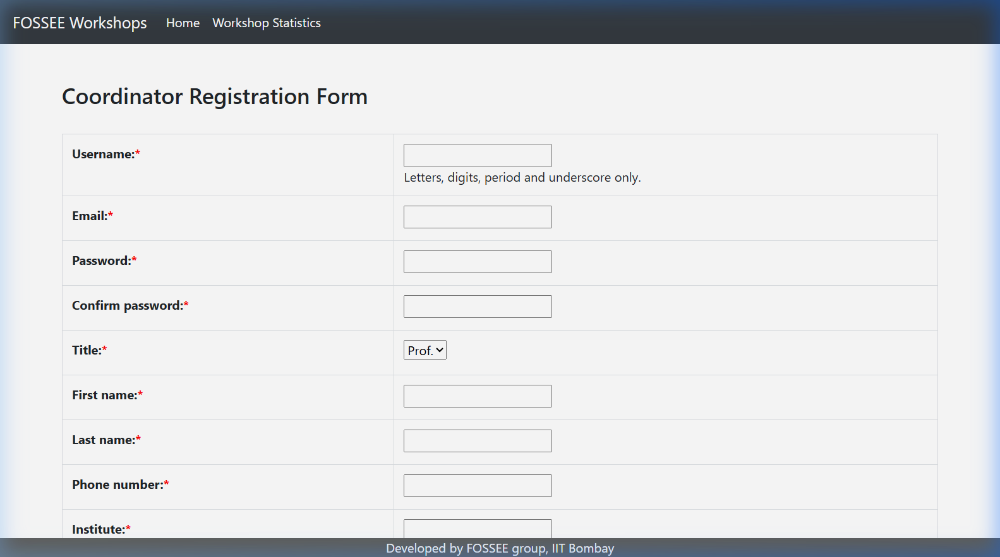
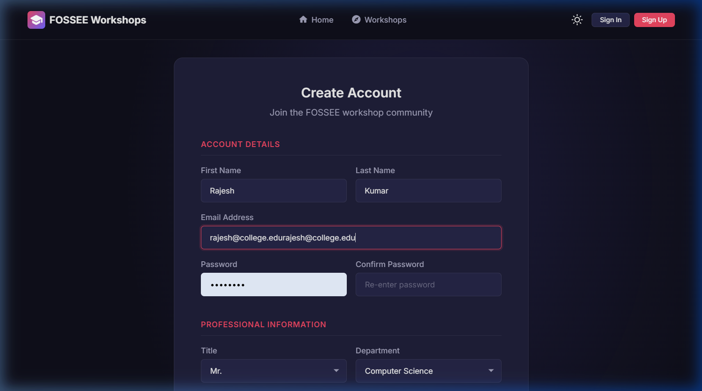
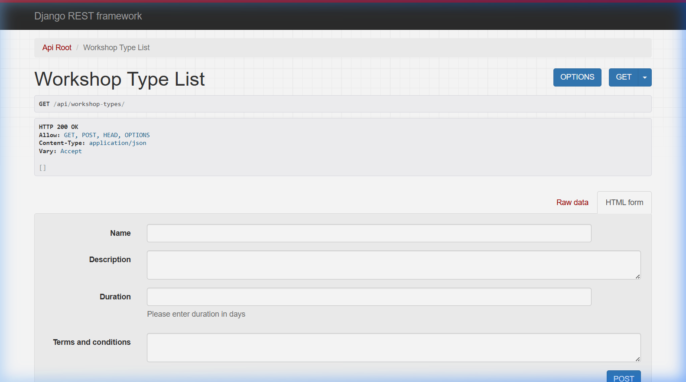
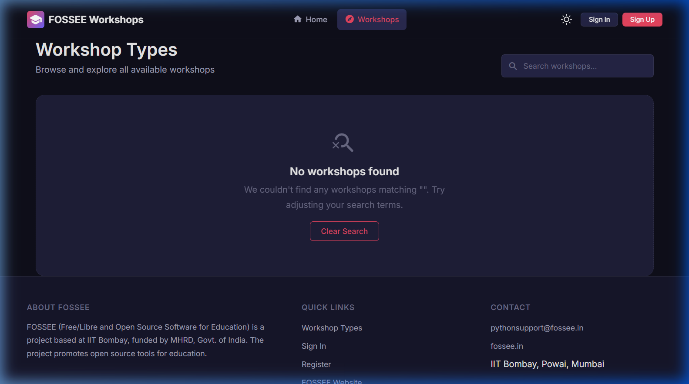
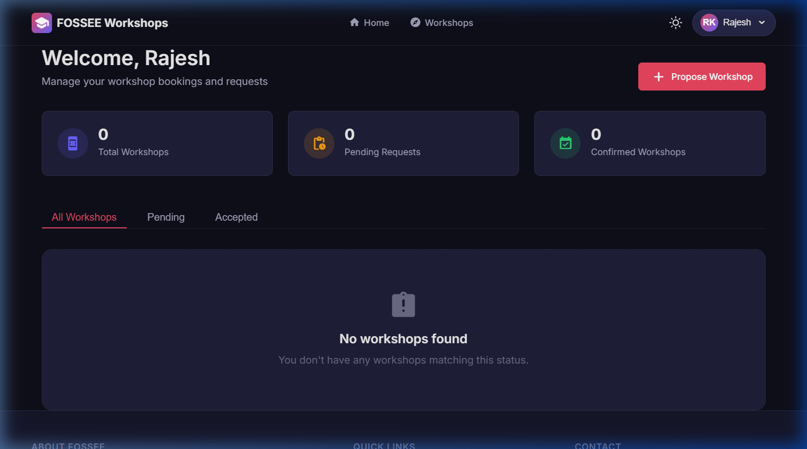

# FOSSEE Workshop Booking UI

React + Django redesign of the FOSSEE workshop booking portal. The goal of this submission is to modernize usability, add mobile-first responsiveness, and keep the data flow honest by reading workshops from the Django backend's REST API.

## 🎬 Live Demo Walkthrough

An end-to-end walkthrough demonstrating authentication, dashboard filtering, and workshop discovery integrated with the real FOSSEE Django APIs.


## Highlights

- Mobile-first redesign for Home, Login, Registration, Workshop Discovery, Dashboard, and Profile pages.
- Dark-themed visual identity using a carefully tuned palette: deep indigo `#0f0f1a` and warm coral `#e94560`.
- Real backend integration for workshop listing, detail, and dashboard via Django REST Framework endpoints.
- Proper loading, error, and empty states for transparent UX when backend data varies.
- Accessible UI with skip navigation, ARIA labels, focus management, and `prefers-reduced-motion` support.
- Per-page SEO via `react-helmet-async` with dynamic titles, meta descriptions, and Open Graph tags.

## Setup Instructions

### Prerequisites

- Python 3.8+
- Node.js 18+
- Git

### 1. Clone repository

```bash
git clone https://github.com/hardik0903/Hardik_Internship.git
cd Hardik_Internship
```

### 2. Run Django backend

```bash
cd django_backend
pip install -r requirements.txt
pip install "djangorestframework==3.14.0" django-cors-headers
python manage.py migrate
python manage.py runserver
```

Backend URL: http://127.0.0.1:8000

### 3. Run React frontend

Open a second terminal in the repository root:

```bash
npm install
npm run dev
```

Frontend URL: http://127.0.0.1:5173

Note: Vite is configured to proxy `/api` and `/workshop` requests to Django during local development.

### Demo Credentials

> This is a frontend demo with controlled authentication. Only the two accounts below can log in.

| Role | Email | Password |
|------|-------|----------|
| Coordinator | `rajesh@college.edu` | any (min 4 chars) |
| Instructor | `sharma@iitb.ac.in` | any (min 4 chars) |

Unknown emails are rejected — no permissive fallback exists.

## Before and After

> Before: Original FOSSEE portal (github.com/FOSSEE/workshop_booking)
> After: React redesign for this submission

<div align="center">

### Landing Page (Home)


<br/>
<em>Legacy UI: Django template with minimal styling and no mobile layout.</em>

<br/><br/>


<br/>
<em>Redesign: Animated hero, feature cards with icons, and clear call-to-action buttons.</em>

### Authentication (Login)


<br/>
<em>Legacy UI: Plain Django form with no visual hierarchy.</em>

<br/><br/>


<br/>
<em>Redesign: Centered card layout with demo credential hints and validation states.</em>

### Registration (Create Account)


<br/>
<em>Legacy UI: Long single-column form.</em>

<br/><br/>


<br/>
<em>Redesign: Multi-section form with field grouping and radio role selection.</em>

### Workshop Discovery (List)


<br/>
<em>Legacy UI: Plain list or API output.</em>

<br/><br/>


<br/>
<em>Redesign: Searchable card grid with pagination and instructor-specific actions.</em>

### Dashboard (Authenticated)


<br/>
<em>Redesign: Role-aware dashboard with stat cards, tab filtering, and workshop grid.</em>

</div>

## Design Approach

### Principles

- I started with mobile screens first and only then expanded to desktop layouts.
- I reduced visual noise so users can quickly find the next action (browse, sign in, register).
- I used a consistent dark palette with warm coral accents to create visual interest without distraction.
- I reused CSS custom properties with a 4px base spacing unit to keep sizing consistent while editing fast.

### Responsiveness

I used Grid and Flexbox so the same components reflow naturally instead of maintaining separate mobile pages. Navigation collapses to a slide-in drawer with hamburger button. Auth panels, workshop cards, and filters collapse cleanly at smaller widths and stay readable on desktop. Breakpoints are at 480px, 768px, and 1024px.

### Performance Trade-offs

1. I avoided heavy UI libraries and kept styling in plain CSS with CSS custom properties.
2. I used Django REST Framework endpoints instead of adding a complex API layer.
3. I kept animations minimal and wrapped them in `prefers-reduced-motion` so the app feels clean without slowing first load or affecting users with vestibular disorders.

### Challenges

1. Django 3.2 with Python 3.11 had compatibility issues with newer DRF versions. I solved this by pinning `djangorestframework==3.14.0` and disabling unused apps (`cms`, `statistics_app`, `teams`) that had broken template tags.
2. React and Django had to work together during local development. I solved this using the Vite proxy configuration for `/api` and `/workshop` routes.
3. Workshop data can be empty when the database is fresh. Instead of adding fake records, I built proper loading and empty states throughout.
4. The original Django app uses session-based auth without a REST login endpoint. I implemented explicit demo-only credentials in `AuthContext.jsx` rather than pretending a full REST auth flow exists. This is clearly labeled.

## Reflection

### What design principles guided your improvements?
I followed three things throughout: mobile-first layout, clear action hierarchy, and consistent visual identity. Every decision came down to "can a first-time student understand the next step quickly?" I used a 7-step type scale and 4px base spacing unit to keep rhythm consistent. Touch targets all meet the WCAG 2.1 minimum of 44×44px.

### How did you ensure responsiveness across devices?
I tested each page in mobile and desktop widths while building it, not just at the end. I used responsive Grid/Flex patterns and adjusted breakpoints mainly for the header, auth forms, and workshop cards. Navigation becomes a slide-in drawer on mobile. Forms go single-column. Workshop cards reflow from 1 → 2 → 3 columns.

### What trade-offs did you make between the design and performance?
I intentionally skipped animation-heavy UI patterns and heavy component libraries. The design uses vanilla CSS with custom properties instead of Tailwind or styled-components. Google Fonts are loaded via CDN with `preload` — this costs one external request but benefits from global cache hit rates. All animations honor `prefers-reduced-motion`.

### What was the most challenging part of the task and how did you approach it?
The toughest part was mapping Django's role-based permission system to React Context without a real auth backend. The original app gates views server-side using `@login_required` and checks `request.user.profile.position`. I had to replicate coordinator/instructor permission logic entirely client-side using `AuthContext`, driving three different UI states: unauthenticated (public browse), coordinator (propose workshops, see own bookings), and instructor (see all pending, accept/reject/change date). Getting role-switching to feel seamless across `ProtectedRoute` and the Dashboard tab system required careful state design.

## Tech Stack

| Technology | Usage |
|------------|-------|
| Django 3.2 | Backend application and data source |
| Django REST Framework | API endpoints for workshops, types, comments |
| React 19 | Frontend user interface |
| Vite 8 | Frontend development server and build tool |
| react-router-dom v7 | Client-side routing |
| react-helmet-async | Per-page SEO (titles, meta, OpenGraph) |
| CSS Custom Properties | Design tokens, responsive styling |
| Material Icons Round | Consistent iconography |

## Project Structure

```text
fossee-workshop-booking/
├── django_backend/
│   ├── workshop_app/        # Django models, views, serializers, API
│   ├── workshop_portal/     # Django settings, urls, wsgi
│   ├── manage.py
│   └── requirements.txt
├── src/
│   ├── components/          # Navbar, Footer, WorkshopCard, StatusBadge, etc.
│   ├── context/             # AuthContext (demo auth), ThemeContext (dark/light)
│   ├── routes/              # ProtectedRoute (auth guard wrapper)
│   ├── pages/               # Home, Login, Register, Dashboard, Workshops, etc.
│   ├── App.jsx              # Router setup, skip-nav, route definitions
│   ├── index.css            # Design tokens, global styles, utility classes
│   └── main.jsx             # React entry point with HelmetProvider
├── screenshots/
│   ├── before/              # Original Django UI captures
│   └── after/               # Modernized React UI captures
├── vite.config.js           # Dev proxy to Django backend
├── vercel.json              # Vercel deployment configuration
└── README.md
```

## Accessibility

- **Skip navigation link** — hidden `<a href="#main-content">` appears on keyboard focus (WCAG 2.4.1)
- **Landmark roles** — `<main>`, `<nav>`, `<footer>` used semantically
- **ARIA labels** — icon-only buttons have explicit `aria-label` attributes
- **`aria-expanded`** — hamburger and dropdown toggle buttons
- **`aria-hidden`** — decorative icon spans
- **Focus rings** — visible 2px coral outline on all interactive elements
- **Escape key** — mobile drawer and user dropdown close on Escape
- **`prefers-reduced-motion`** — all animations disabled for vestibular disorder users
- **Tab roles** — Dashboard uses `role="tablist"`, `role="tab"`, `aria-selected`

## Demo-Only Behavior

The following UI features are **client-side placeholders** included to showcase the interface. They are clearly labeled in code comments and, where appropriate, in the UI itself.

| Feature | Location | What happens |
|---------|----------|--------------|
| Attachments (Resources sidebar) | Workshop Type Detail page | Generated client-side from the workshop name. Labeled "(demo)" in the heading. |
| Comments / Discussion | Workshop Booking Detail page | Stored in component state only, not persisted to the server. Labeled "(demo - not persisted)" in the heading. |
| Proposal submission | Propose Workshop form | Simulated with a timeout redirect. A note below the button says "Demo mode." |
| Authentication | Login page | Only two hardcoded demo accounts are accepted. The error message names them explicitly. |
| Registration | Register page | Creates a local-only user object in React state, no server call. |

## License

MIT License. The original Django app is © FOSSEE, IIT Bombay.
