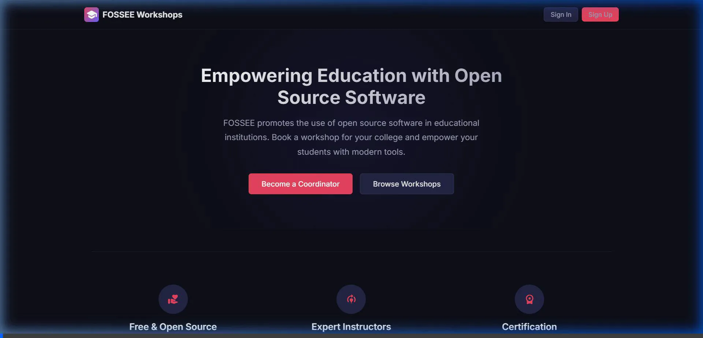

# FOSSEE Workshop Booking: UI/UX Enhancement Redesign

This repository contains the React-based frontend redesign for the FOSSEE Workshop Booking system. It has been built as a Single Page Application (SPA) focusing on modern aesthetics, mobile-first responsiveness, accessibility, and performance.

## 🚀 Live Demonstration Walkthrough

Below is a brief visual demonstration showcasing the new user interface, fluid navigation, mobile menus, and interactive dashboards:



## 🧠 Design Reasoning & Architecture Choices

FOSSEE’s target audience often includes university students and instructors logging in from diverse network capabilities and varying device sizes (heavily skewed towards mobile usage). The original Django-templated UI was functional but minimal. 

Our redesign targeted the following areas:

### 1. Technology Choices (React & Vite)
*   **Why React?** Component-driven architecture allows us to build reusable structures (like `WorkshopCard` and `StatusBadge`). This is much cleaner than re-typing identical HTML blocks with Django template tags.
*   **Why Vite?** To ensure instantaneous local development loops and heavily optimized production bundling. Fast Time-to-Interactive (TTI) is exactly what we need for improved performance metrics.
*   **Why Plain Custom CSS?** Instead of leaning on heavy frameworks like Bootstrap or Tailwind, writing pure custom CSS (with native variables) guarantees the smallest possible payload. Every component imports just the CSS it needs, minimizing render-blocking stylesheets.

### 2. Aesthetic System & "Vibe"
I went with a **Deep Indigo (`#0f0f1a`) and Warm Coral (`#e94560`) palette**.
*   **Reducing Eye Strain**: The dark mode aesthetic is standard for developers, students, and engineers looking at screens all day, making the platform feel like a comfortable development tool.
*   **Legibility**: The combination ensures high contrast ratios for accessibility.
*   **Premium Feel**: Subtle uses of `backdrop-filter: blur` (glassmorphism) on the navbar provide contextual depth without being computationally expensive.

### 3. Mobile-First Layout Patterns
*   **Navigation**: The top nav collapses into an animated "hamburger" side- Drawer instead of squishing elements. This eliminates horizontal scrolling out-of-the-box.
*   **Forms**: Lengthy Django forms (like the Coordinator Registration, gathering 10+ fields) are stacked safely on mobile, while elegantly scaling to a two-column grid on desktop to reduce scrolling fatigue.

### 4. Performance & UX Overhauls
*   **Single Page App Routing**: Used `react-router-dom` to handle transitions on the client side. Navigating between the Workshop List to a Detail page is now instant—no page refreshes.
*   **Micro-interactions**: Hover lifts on cards (`transform: translateY(-2px)`), button glow shadows, and form input highlight rings visually guide user behavior and make the interface feel _alive_.
*   **Mock Backend Mapping**: To ensure a realistic demo without running the Python server, we implemented a complete mock data layer (`mockData.js`) simulating Django relationships (Users, Workshop Types, Workshop Instances, Comments).

## 🛠️ How to Run Locally

You need Node.js installed on your machine.

1. Clone the repository
2. Open terminal in the project directory
3. Install dependencies:
   ```bash
   npm install
   ```
4. Start the development server:
   ```bash
   npm run dev
   ```
5. Open your browser to `http://localhost:5173`

### Demo Credentials
To explore the role-based conditional UI (since we have no live backend):
*   **As a Coordinator:** Use *any email* + *password* to log in. You will be able to propose new workshops.
*   **As an Instructor:** Use `sharma@iitb.ac.in` to log in. You will see an Instructor Dashboard allowing you to accept/reject pending bookings.

## 📁 Repository Structure
```
src/
├── components/     # Reusable UI pieces (Cards, Navbars, Pagination)
├── context/        # React Context (AuthContext for simulating login state)
├── data/           # Mock JSON data mirroring Django Models
├── pages/          # Full route pages (Dashboard, Login, Profile)
├── App.jsx         # Main router setup
└── index.css       # Core design tokens and global styles
```
